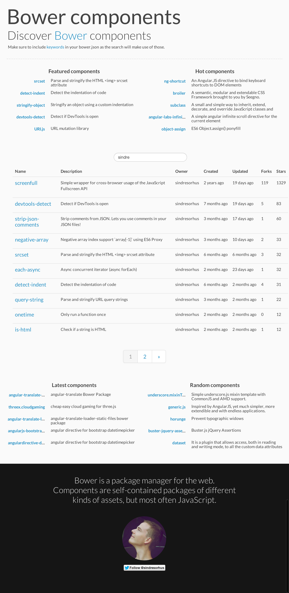

# Bower components site

**Deprecated** as it's been moved to [the Bower organization](https://github.com/bower/search)

---

> Site to discover [Bower](http://bower.io) components

Makes it easy to search and discover Bower components. It works by using a [server](https://github.com/bower/search-server) to periodically fetch the registry and join it with GitHub metadata and bower.json/package.json keywords.

## Screenshot

## License

MIT © [Sindre Sorhus](http://sindresorhus.com)
